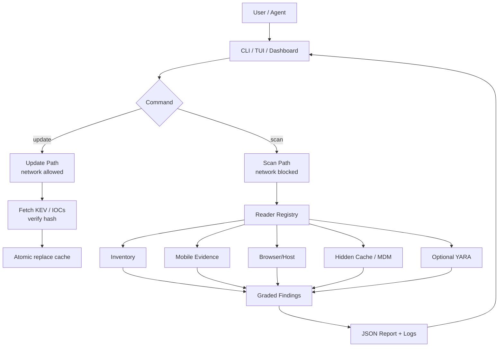
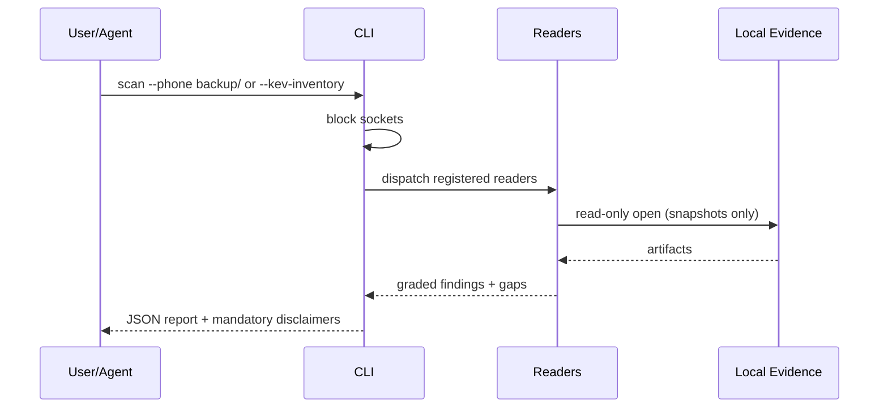
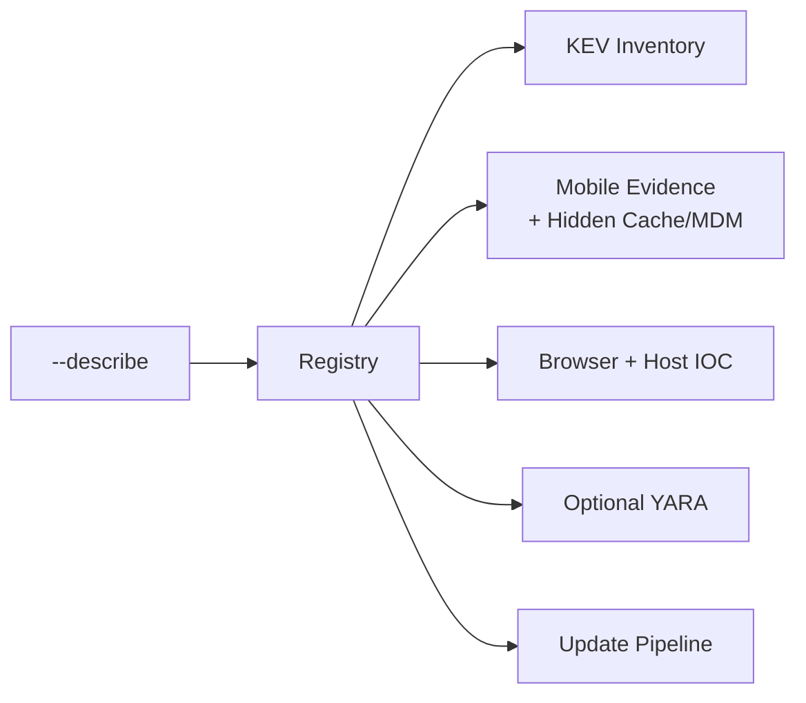

# Architecture

## High-Level Flow

```mermaid
flowchart TD
    A[User / Agent] --> B[CLI / TUI / Dashboard]
    B --> C{Command}
    C -->|update| D[Update Path<br/>network allowed]
    C -->|scan| E[Scan Path<br/>network blocked]
    D --> F[Fetch KEV / IOCs<br/>verify hash]
    F --> G[Atomic replace cache]
    E --> H[Reader Registry]
    H --> I[Inventory]
    H --> J[Mobile Evidence]
    H --> K[Browser/Host]
    H --> L[Hidden Cache / MDM]
    H --> M[Optional YARA]
    I & J & K & L & M --> N[Graded Findings]
    N --> O[JSON Report + Logs]
    O --> B
```

## Scan Path (Network Blocked)

```mermaid
sequenceDiagram
    participant U as User/Agent
    participant CLI as CLI
    participant R as Readers
    participant FS as Local Evidence
    U->>CLI: scan --phone backup/ or --kev-inventory
    CLI->>CLI: block sockets
    CLI->>R: dispatch registered readers
    R->>FS: read-only open (snapshots only)
    FS-->>R: artifacts
    R-->>CLI: graded findings + gaps
    CLI-->>U: JSON report + mandatory disclaimers
```

## Module Registry

```mermaid
graph LR
    Describe[--describe] --> Registry
    Registry --> KEV[KEV Inventory]
    Registry --> Mobile[Mobile Evidence<br/>+ Hidden Cache/MDM]
    Registry --> Host[Browser + Host IOC]
    Registry --> Patterns[Optional YARA]
    Registry --> Update[Update Pipeline]
```

Clean result ≠ safe. Always list coverage.not_checked.
